### Hi there, I'm Jonathan Oppenheimer 👋

I'm currently a sophomore studying [computer science](https://www.cs.purdue.edu/) at Purdue University in West Lafayette, Indiana. Right now, I’m learning  about [Systems Programming](https://www.cs.purdue.edu/academic-programs/courses/canonical/cs252.html) and [Linear Algebra](https://www.math.purdue.edu/academic/courses/semester/202310/ma26500/). If you want to get in contact with me, please use any of the badges listed below. Additionally, my resume is available [here](https://github.com/JonathanOppenheimer/jonathanoppenheimer.wtf/blob/master/static/resume.pdf). 

  <!-- GitHub badge --->
   
  <!-- Outlook badge --->
   
  <!-- Instagram badge --->
   
  <!-- Linkedin badge --->
   
  <!-- Spotify badge --->
  

  <!-- User stats badge --->
  
  <!-- Language stats --->
  
   
  <!-- Visits badge --->

  <!-- Last updated badge --->
  

This readme was created using resources from [Awesome GitHub Profile](https://github.com/abhisheknaiidu/awesome-github-profile-readme). Check it out! 
